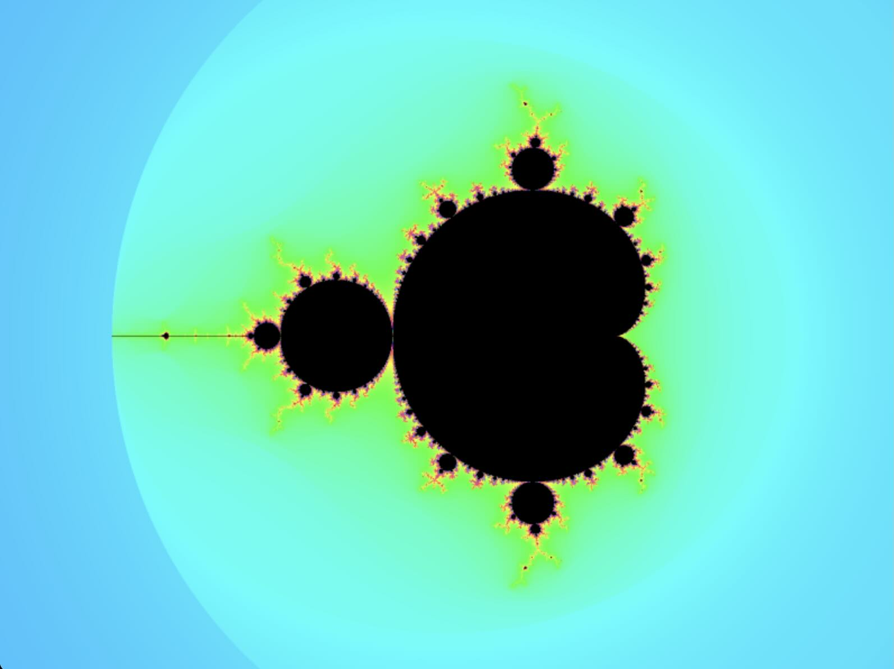
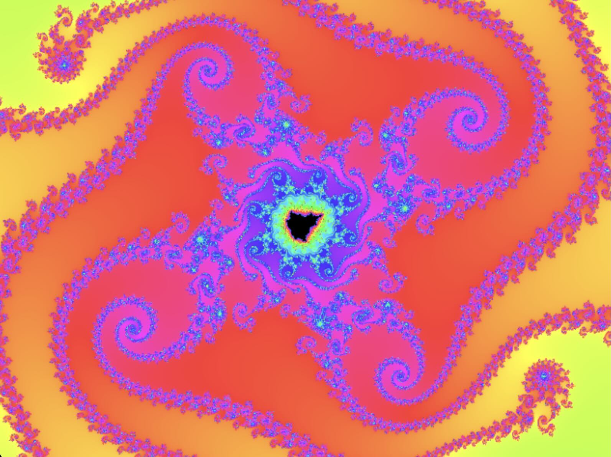

# Fractal

Explore mandelbrot fractal.

## Features

- Continuous zoom and pan
- Multi-thread rendering
- High precision with MPFR
- Anti-aliasing

## Controls

- Drag mouse to pan
- Scroll and +/- keys to zoom
- Double click to zoom in, with shift out
- [/] keys to dec/inc max iterations

## Examples

## License

MIT
